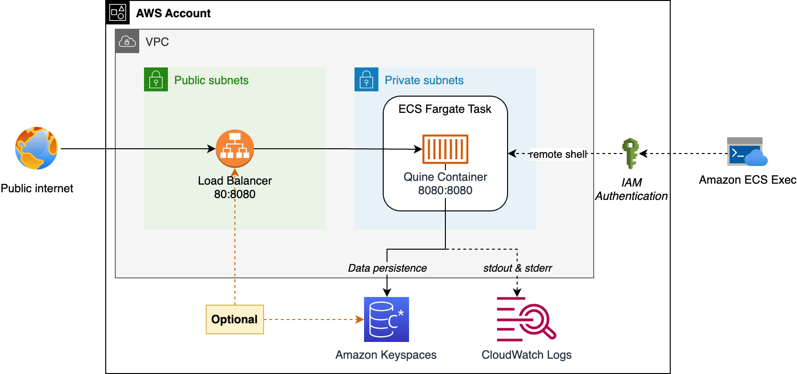

# Launching Quine with AWS CDK

This project deploys [Quine](https://github.com/thatdot/quine), an open source streaming graph solution, to an AWS account using the [AWS Cloud Development Kit (CDK)](https://github.com/aws/aws-cdk). 

The open source Quine project provides Quine's core graph technology and includes a demo implementation in the form of an executable JAR that can be run as a single compute node. [thatDot](https://www.thatdot.com/), a company formed by the creators of Quine, separately sell [Quine Enterprise](https://www.thatdot.com/product/quine-enterprise), a production-ready version of Quine with support for Enterprise features like scale-out Quine compute clusters. 

## Status

:warning: **Deployment using Amazon Keyspaces not fully functional**: 

This project allows you to deploy Quine using either a local instance of RocksDB within the Quine container for data persistance **or** using Amazon Keyspaces.

For now, deployments using Amazon Keyspaces will fail.

### Why Quine currently fails to start with Amazon Keyspaces

As of this writing, Amazon Keyspaces does not support `select DISTINCT` queries needed by Quine. So, underlying infrastructure will successfully deploy but our Quine container on ECS Fargate will fail to start and the CDK deployment will be rolled back. To avoid rolling back *everything*, use the option `runQuineContainer: false,` in [bin/quine-aws-cdk.ts](./bin/quine-aws-cdk.ts) for your first deployment to create an ECS service with desired running task count of 0. Once that successfully deploys, you can then use `runQuineContainer: true`, which will update the service to desired count of 1. The service will still fail to deploy, but at least this way you want need to wait for the entire stack to roll back. 

## Quickstart

**Prerequisites:**
* AWS CLI and AWS CDK installed and configured with IAM role or user credentials that have the ability to launch a CloudFormation stack for required resources (ECS, Keyspaces, Load Balancer, etc.)

**Quickstart:**
1. Clone this repo
2. Run `npm install` from the project root
3. Run `cdk deploy`

By default, the project will: 
* Create a new VPC running Quine as an ECS Fargate service using the default `thatdot/quine` image
* Configure Quine to use a local instance of RocksDB as its data persistor
* Create a public load balancer to expose Quine's web interface to your local machine's public IP address

You can optionally edit the stack constructor properties in [bin/quine-aws-cdk.ts](./bin/quine-aws-cdk.ts) to control disable the public load balancer, add or remove IP addresses to the load balancer security group, or enable and configure Amazon Keyspaces as your persistence layer.

## Deployment Architecture

An overview of what you get is below: 



### Quine Container Image (RockSDB persistor)

If using Quine without Amazon Keyspaces as an external persistor, we use the `thatdot/quine` public container image published by thatDot. This image will store data locally within Quine container using RocksDB. 

### Quine Container Image (Amazon Keyspaces)

The CDK project creates a Quine container image and stores is it in your Amazon Elastic Container Repository (ECR). This project's [Dockerfile](lib/images/quine/Dockerfile) does the following:

1. Starts with a forked image of Quine ([FROM berbs/quine-aws-sigv4-test](https://hub.docker.com/r/berbs/quine-aws-sigv4-test)). This image was built from my fork ([matwerber1/quine](https://github.com/matwerber1/quine)) of the open source  code at [thatdot/quine](https://github.com/thatdot/quine). This forked image simply loads the official AWS SigV4 authentication plugin (v4.08) which allows the Datastax driver in Quine to use IAM role credentials to authenticate to Amazon Keyspaces. 

2. Adds [lib/images/quine/cassandra_truststore.jks](lib/images/quine/cassandra_truststore.jks) to the image, which provides the Starfield digital certificate (`https://certs.secureserver.net/repository/sf-class2-root.crt`) to Quine and may be needed for backwards compatibility to connect to Amazon Keyspaces. See [Using a Cassandra Java client driver to access Amazon Keyspaces programmatically](https://docs.aws.amazon.com/keyspaces/latest/devguide/using_java_driver.html#using_java_driver.BeforeYouBegin) in AWS docs for detail. 

    **Note:** I created the `cassandra_truststore.jks` with a password of `123456` for demo purposes. To improve security, you may want to consider re-creating this file yourself with a strong password per the instructions in the AWS docs above.

3. Generates a `quine.conf` file by injecting needed runtime variables (like your current AWS Region) into a copy of of [lib/rsources/quine/conf-template.conf](lib/rsources/quine/conf-template.conf). The template adapts guidance from the [AWS Authentication Plugin for Java 4.x](https://docs.aws.amazon.com/keyspaces/latest/devguide/using_java_driver.html#java_tutorial.SigV4) by modifying it to take advantage of [Quine's optional loading of a quine.conf configuration at runtime](https://docs.quine.io/reference/configuration.html).

4. Modifies the container entry point to run the Quine JAR with the following two additional flags:
    
    ```sh
    -Djavax.net.ssl.trustStore=/cassandra_truststore.jks
    -Djavax.net.ssl.trustStorePassword=123456
    ```

### Accessing Quine container's shell

After deploying Quine to an ECS Fargate container, you can open a remote shell with the container as follows: 

```sh
aws ecs execute-command --cluster $CLUSTER \
    --task $TASK_ARN \
      --container quine \
     --interactive \
     --command "/bin/sh"
```

* Replace $CLUSTER with the name of the ECS cluster created by the CDK. 
* Replace $TASK_ARN with the task ARN running the Quine container inside your ECS cluster. 

You may optionally use the command below to output the cluster name to a local JSON file: 

```sh
cdk deploy --outputs-file outputs.json --require-approval never
```

Once the local JSON file is available, you can then use the AWS CLI along with [jq](https://stedolan.github.io/jq/) to find the task ARN and connect to the container using the following shell script snippet: 

```sh
cdk deploy --outputs-file outputs.json --require-approval never

OUTPUTS=$(cat outputs.json | jq '.QuineAwsCdkStack')
CLUSTER=$(echo $OUTPUTS | jq -r '.ecsClusterName')
TASK_ARN=$(aws ecs list-tasks --cluster $CLUSTER --output json | jq -r '.taskArns[0]')

echo $OUTPUTS | jq '.'

aws ecs execute-command --cluster $CLUSTER \
    --task $TASK_ARN \
      --container quine \
     --interactive \
     --command "/bin/sh"
```

ECS Exec requires that your local AWS CLI is configured with [IAM permissions required for ECS Exec](https://docs.aws.amazon.com/AmazonECS/latest/developerguide/ecs-exec.html#ecs-exec-enabling-and-using).

### Accessing Quine's web browser app

The Quine application provides a demo web application listening on port 8080. If you want to access this app over the internet without the need for private connectivity (e.g. VPN) to your VPC, you can add the following two lines to your stack configuration (`bin/quine-aws-cdk.ts`) to create a public load balancer that will forward port 80 requests to the container from the IP addresses of your choice: 

```js
new QuineAwsCdkStack(app, 'QuineAwsCdkStack', {
    publicLoadBalancerEnabled: true,
    publicLoadBalancerIngressPeers: [
        yourPublicIP                    // see bin/quine-aws-cdk.ts for detail
    ]
});
```